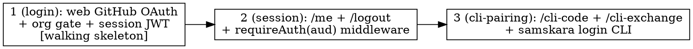

# Plan: Auth System (GitHub OAuth + org gate + CLI pairing + API auth)

> Implements `.harness/features/auth-system/design.md`. The identity/authentication foundation for
> samskara. GitHub OAuth web login, org-allowlist gate, session/CLI JWTs (`aud: web | cli`), and a
> browserless CLI pairing flow. Builds on the existing identity mesh; adds **no new tables** (pairing
> codes are in-memory per design A7).

## Acceptance Criteria

- A member of a seeded org can log in via GitHub OAuth in a browser and land authenticated
  (`session` cookie set, `GET /api/auth/me` returns their user).
- A user whose GitHub orgs do not intersect any seeded org is rejected at the callback
  (`?error=not_member`), and no `users` row is created for them.
- CSRF is enforced: a callback whose `state` does not match the `oauth_state` cookie is rejected.
- User upsert is idempotent by `github_id`: logging in twice updates the row, never duplicates it.
- A web-authed user can mint a CLI pairing code; the CLI redeems it (once) for an `aud:cli` JWT and
  stores it at `~/.samskara/token` with `0600` perms.
- Route tokens are audience-scoped: an `aud:cli` token is rejected on a web-only route and an
  `aud:web` token is rejected on a cli-only route.
- `bun run seed:org <slug>` inserts/updates an `orgs` row.
- Baseline stays green: existing identity-mesh tests, typecheck, lint all still pass.

## Codebase Context

### Target repo layout (Turborepo + Bun, `packages/*`)
- `packages/server` — Hono 4.7 + `@hono/node-server`; Drizzle 0.39 + `postgres`; vitest 3 +
  testcontainers 10 (`pgvector/pgvector:pg16`). `src/app.ts` is a **bare Hono app** — only
  `GET /health` and a TODO to mount `./routes`. `src/routes|services|lib/index.ts` are empty stubs.
- `packages/web` — React 18 + Vite 6 + Tailwind 4. `App.tsx` is a placeholder; no HTTP calls, no
  router, no dev proxy. `vite.config.ts` has no `server` block.
- `packages/cli` — commander 13. `index.ts` registers name/version only; no HTTP client, no commands.
- `packages/core` — shared placeholder.

### Verified preconditions
- **jose is NOT installed** — Phase 1 adds it to `@samskara/server` deps (design A8 names jose).
- **No new migration needed** — auth uses existing `users`, `orgs`, `user_orgs` (schema.ts, migrations
  0000+0001 applied). Pairing codes are an in-memory `Map` (design A7). Do **not** add a table.
- **Env is already populated** at repo-root `.env` (gitignored): `GITHUB_CLIENT_ID`,
  `GITHUB_CLIENT_SECRET`, `JWT_SECRET`, `PUBLIC_BASE_URL`, `COOKIE_SECURE`, `DATABASE_URL`,
  `VITE_API_BASE_URL`. A committed `.env.example` currently has only `DATABASE_URL` — Phase 1 adds the
  auth keys (blank secrets). `turbo.json` passes through only `DATABASE_URL` — Phase 1 adds
  `GITHUB_*`, `PUBLIC_BASE_URL`, `COOKIE_SECURE`, `JWT_SECRET`, `VITE_API_BASE_URL`.
- **Ports (verified in design):** backend `:3000`, web `:8000`. Vite must proxy `/api` → `:3000`
  (same-origin cookies). `docker-compose.yml` runs Postgres on host `:5433`.
- **Test infra:** testcontainers pattern is established in `src/db/db.test.ts` — `PostgreSqlContainer`
  + `bun run db:migrate` in `beforeAll`, `describe.skipIf(!dockerAvailable())`. Reuse it verbatim.
- **App must be constructable with injected deps for tests.** `app.ts` currently exports a module-level
  `app`. Phase 1 introduces `buildApp(db, env, { githubClient })` (design A10) so tests inject a stub
  `GithubClient` + a testcontainers db; the module-level `app`/`index.ts` become a thin real-deps
  wrapper over it.
- **Strict TS** (`strict`, `verbatimModuleSyntax`, `noUncheckedIndexedAccess`) + **Biome** (double
  quotes, no semicolons, 100-width). Follow code-quality strict/functional patterns.

### Design decisions carried in (see design.md Key Decisions)
- A2 org gate at callback; A3 membership REQUIRED; A5 upsert by `github_id` (no email adoption);
  A6/A7 in-memory single-use pairing codes with ~5m TTL; A8 jose, issuer, 7d, `aud`-checked;
  A9 httpOnly cookies (`oauth_state` ~10m, `session` 7d Secure SameSite=Lax); A10 injectable
  `GithubClient`.

### Auto-mode decisions (no live Q&A; recorded here)
- **Config surface:** a single `Env` object parsed once at startup (from `process.env`) and threaded
  into `buildApp`; tests pass a literal `Env`. No new config framework.
- **Open Questions from design resolved as written:** `getOrgs` uses `GET /user/orgs`; CLI token path
  `~/.samskara/token`, perms `0600`.
- **Web tests stay light** (no jsdom/RTL wired). Web login UI correctness is proven by the System E2E
  (real browser), not unit tests — consistent with the design's "BOTH required" testing section.
- **`aud` gating negative** (cli-token-on-web-route and vice versa) lives in Phase 3, which is the
  first phase where both a web session and a cli token exist together.

## Phases (vertical slices)

- **Phase 1 (login)** — walking skeleton. Establishes all shared plumbing: `buildApp` + injected
  `GithubClient` seam, jose sign/verify, cookie handling, `Env`, the `seed:org` script, and the two
  OAuth routes with the org gate. Wide fan-out root.
- **Phase 2 (session)** — builds the reusable `requireAuth(aud)` middleware and exercises it on
  `/me` + `/logout`. Depends on P1 (needs a valid session cookie to read).
- **Phase 3 (cli-pairing)** — the full browserless CLI capability: in-memory pairing codes, the two
  cli routes, and the `samskara login` command. Depends on P2 (reuses `requireAuth(web)` to guard
  `/cli-code`; proves cross-audience gating).

## System E2E Tests

Cross-slice only — the design's mandated real-browser run chaining all three slices. Environment/harness
setup (stack up, migrate, seed, start servers) is operational and lives in the run instructions, not here.

### S-E2E-1: Real GitHub login → me → CLI pairing (real browser, real GitHub)
Chains Phase 1 (login) → Phase 2 (`/me`) → Phase 3 (CLI pairing); cannot run inside any single phase.
- **Steps:**
  1. `bun run stack:up && bun run db:migrate`; `bun run seed:org vertexcover-io`.
  2. Start backend `:3000` and web `:8000` (Vite proxies `/api` → `:3000`).
  3. In a browser open `http://localhost:8000`, click **Login with GitHub**, approve on GitHub.
  4. Confirm redirect back **authenticated**; `GET /api/auth/me` returns the user.
  5. Confirm DB has a `users` row + a `user_orgs` row for `vertexcover-io`.
  6. Run `samskara login`, complete the pairing code, confirm the CLI stores an `aud:cli` token.
- **Expected:** every step succeeds; the exact `/api/auth/me` JSON + the two DB rows + the stored CLI
  token are reported. Any failure is reported exactly (not masked by green unit tests).
