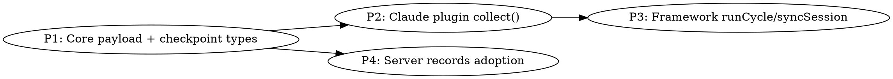

# Plan: Collector Transport

Vertical slices, but this is a contract-migration refactor so phases are dependency-layered. Each
phase is TDD (RED → GREEN → REFACTOR). Server tests need docker (available).

## Phase 1 — Core payload + checkpoint types (`packages/core`)

- `ingest/types.ts`: add `ParsedRecord`; restructure `IngestBase` to `{ sessionId, project,
  sourceRelativePath, title?, records }`; `IngestPayload` union = `main` (no extra) | `subagent`
  (+`agent`); drop `SessionFields`, `RawLine`, `rawLines`. `NormalizedMessage` drops `lineUuid` +
  `lineNumber`, keeps `subIndex` + `sessionId` + rest.
- `collector/types.ts`: replace `FileState`/`WatcherState`/cursor with `CheckpointBase`,
  `ClaudeCheckpoint`, `Checkpoint` union, `CheckpointBody`, `CheckpointStore`. New `AgentPlugin`
  interface (`collect(prev, deps)`), `CollectDeps`, `SessionBatch`, `SessionTrack`. Keep `AgentInfo`
  in ingest types (design puts it there). Remove `globs`, `ChangedFile`, `CollectResult`,
  `SubagentInfo`, `CollectContext`, `SessionContext`.
- `collector/state.ts`: `readCheckpoints`/`writeCheckpoints` over `CheckpointStore`.
- Update core `index.test.ts` exports test.

## Phase 2 — Claude plugin `collect()` (`packages/core/src/collector/plugins/claude.ts`)

- `createClaudePlugin(fs)` returns `{ source, collect(prev, deps) }`.
- `collect`: glob own patterns via `deps.glob`; stat-gate each (skip if mtime+size match checkpoint);
  for changed files `readNewLines` from watermark, parse into `ParsedRecord`s (fan-out per line,
  drop lineUuid/lineNumber from messages); resolve project via `deps.resolveProject(cwd)` (emit no
  track on failure); build `SessionTrack` (IngestPayload fields + checkpointKey + records +
  checkpointAt); group by session, main track first → `SessionBatch[]`.
- `checkpointAt(lineNumber)` closes over the file's fresh stat → `{ source, mtime, size,
  lineProcessed: lineNumber }`.
- `helpers.ts`: `readNewLines` now takes a plain `fromLine` watermark (not `FileState`); keep
  `iterJsonLines`, `compact`.

## Phase 3 — Framework `runCycle`/`syncSession` (`packages/cli/src/watcher/driver.ts`)

- `runCycle`: `readCheckpoints` → `plugin.collect(prev, deps)` → `Promise.all(batches.map(
  syncSession))` → merge disjoint maps → `writeCheckpoints`.
- `syncSession(batch)`: sequential tracks (main first, given by plugin); skip track w/o sessionId;
  `sliceByMessages(track.records, MESSAGE_CAP)`; per chunk `sink.send({...track, records})` minus
  transport-only fields; on 2xx `checkpointAt(lastCompleteLine)` → `wrap(track, body)` w/ base
  (`filePath`, `lastUpdatedAt` from clock); on non-2xx stop session. Log at both points.
- `sliceByMessages`: chunk by fanned-out message count ≤ MESSAGE_CAP; each chunk exposes
  `records` + `lastCompleteLine` (last line whose full fan-out fit).
- Remove `orderMainFirst`, subagent regex, `changedFileFor`, `flushFile`, `capMessages`,
  `buildPayload`, `rawLinesFor`, project-in-loop. Rename `LINE_CAP` → `MESSAGE_CAP`.
- Update `sink.ts`/`index.ts` types where `IngestPayload` shape changed. `resolveProject` moves into
  plugin deps (still lives in cli, passed via `deps`).

## Phase 4 — Server records adoption (`packages/server`)

- `routes/ingest.ts`: `zBase` → `{ sessionId, project, sourceRelativePath, title?, records }`;
  `zRecord = { lineUuid, lineNumber, raw, messages: zMessage[] }`; `zMessage` drops lineUuid +
  lineNumber; union drops `session`, keeps subagent `agent`. Log `eventCount` = sum of records'
  messages.
- `services/ingest.ts`: iterate `records`; per message rebuild key `keyOf(record.lineUuid,
  m.subIndex)`, stamp `record.lineNumber` + `record.raw`; `title` from base → session upsert.
- `repositories/sessions.repo.ts`: `UpsertSessionInput.fields` → just `{ title? }` (or inline
  `title`). Drop model/cwd/cliVersion/permissionMode writes (columns stay; sourced elsewhere/later).
- Update `ingest.test.ts` + `routes/ingest.test.ts` payload builders to `records` shape.
