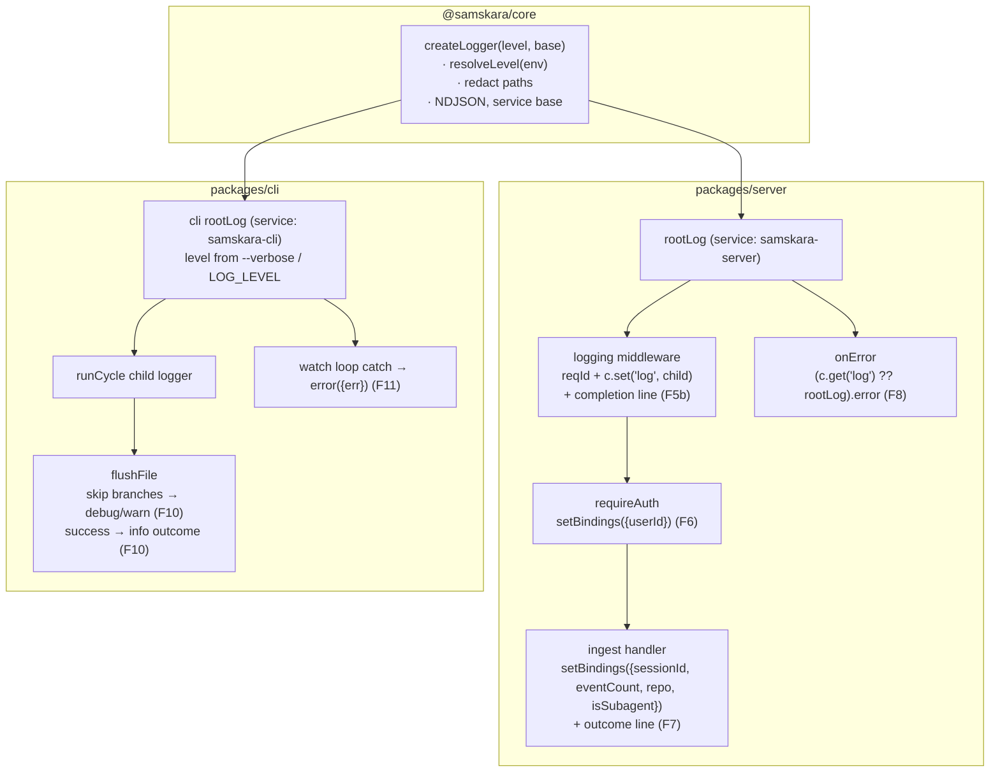
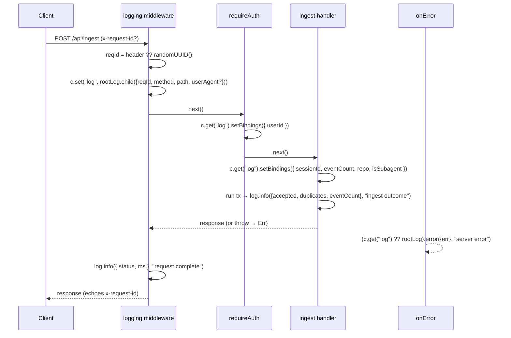
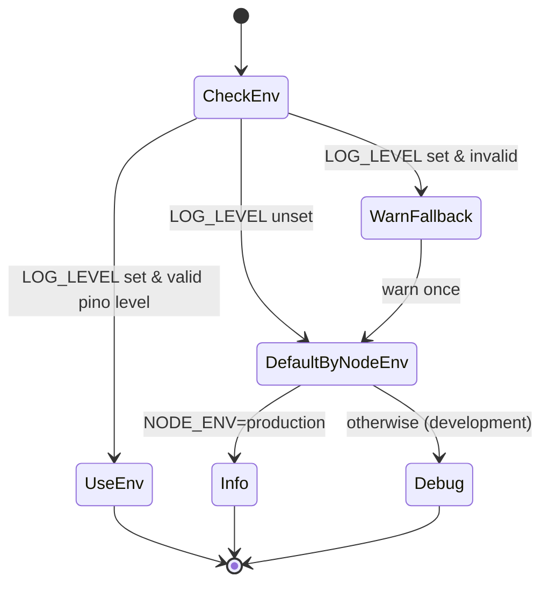

# Structured Logging Layer — Design

## Problem Statement

The application has no real logging. There is no request id, no per-request user/session
context, no log levels, and no way to turn up verbosity when ingestion silently fails. When a
session does not show up in the UI, there is no structured trail to answer "where did it drop?"
— the CLI's `skipped` branches return silently, its top-level catch logs only `error.message`,
and the server's ingest path logs nothing at all.

We want one coherent, level-based, structured (JSON) logging layer across server and CLI, with
rich context (`reqId`, `sessionId`, `userId`) so ingestion failures on either side are
diagnosable by reading logs. Default `info` output must already carry enough context to debug;
`LOG_LEVEL=debug` / `--verbose` reveals exactly why a session was skipped or an upload failed.

## Context

What exists today:

- **`@samskara/core`** — shared domain package (collector + ingest types, some fs/state I/O).
  Already ships runtime deps. No logging.
- **Server** (`packages/server`) — Hono app built in `buildApp` (`app.ts`), three routes
  (`/health`, `/api/auth`, `/api/ingest`). No middleware, no `onError`, no `notFound`. Auth via
  `requireAuth` per-router middleware setting `c.set("user", …)`. Ingest service
  (`services/ingest.ts`) runs a DB transaction and returns `{ ingested, deduped }` or swallows
  `SESSION_NOT_FOUND` into `{ error: "sessionNotFound" }`. Boot line is a bare `console.log` in
  `index.ts`. Migrations run via a **separate** `drizzle-kit migrate` script, never in the
  server process.
- **CLI** (`packages/cli`) — commander-based; `watch` subcommand drives an infinite `runCycle`
  loop. `watcher/driver.ts` `flushFile` has three silent early-returns (empty messages, missing
  sessionId, non-2xx upload status) and no success log. Top-level catch in `watcher/index.ts`
  logs only `error.message`. No `--verbose`.

Triggered by: silent ingestion failures being undiagnosable.

## Product Requirements (PRD)

No PRD — internal-facing observability change. The "user" is an operator/agent reading logs.

## Requirements

### Functional Requirements

- **F1:** A shared `createLogger` factory lives in `@samskara/core`, producing a pino logger
  configured from a resolved level and a fixed set of base fields (`service`, plus
  caller-supplied binds).
- **F2:** Log level resolves from `LOG_LEVEL` env var when set (a valid pino level); otherwise
  defaults to `info` in production and `debug` in development (`NODE_ENV`). An invalid
  `LOG_LEVEL` falls back to the default (fail-open) and warns once.
- **F3:** Output is newline-delimited JSON on the process's standard stream in all environments
  (no pretty transport).
- **F4:** The logger redacts a fixed set of sensitive paths (`token`, `authorization`,
  `*.token`, `req.headers.authorization`, `password`, `secret`) via pino's `redact` option.
  Message bodies that may carry event content (`content`, `thinking`, `raw`) are never passed to
  the logger — the ingest paths log counts and ids only.
- **F5:** The server installs a global middleware registered at the **top of `buildApp`, before
  the first `app.route(...)` call** (Hono runs middleware in registration order, so it must
  precede all routers and their per-router auth). It: generates/propagates a request id
  (`x-request-id` header if present, else `randomUUID()`, echoed back on the response) and binds
  a per-request child logger to `c` via `c.set("log", …)` carrying `{ reqId, method, path }`
  plus `userAgent` when present. Subsequent enrichment (F6 `userId`, F7 `sessionId`) merges onto
  this same child.
- **F5b:** After the handler resolves, the same middleware logs one request-completion line at
  `info` with `{ status, ms }` on the request child logger.
- **F6:** When `requireAuth` resolves a user, the request-bound child logger is enriched via
  `c.get("log").setBindings({ userId })` so all subsequent logs on that request carry it (single
  mutated instance).
- **F7:** The ingest handler enriches the request logger with `sessionId` via `setBindings`, and
  additionally binds the ingestion context it already holds — `eventCount` (message count),
  `repo` (project slug/identity), `isSubagent` (`type === "subagent"`). After the DB transaction
  resolves it logs one **outcome** line at `info` with
  `{ sessionId, accepted, duplicates, eventCount }` (mapping the service's `ingested` →
  `accepted`, `deduped` → `duplicates`). A `sessionNotFound` outcome logs at `warn`.
- **F8:** The server's `onError` handler logs the error at `error` through the request logger
  when present, else the server root logger: `(c.get("log") ?? rootLog).error({ err }, "server
  error")`. The boot "listening" line goes through the server root logger.
- **F9 (CLI):** The CLI resolves a root logger via `createLogger` with `service: "samskara-cli"`.
  A **global** `--verbose` commander flag (any subcommand) raises the effective level to `debug`;
  `LOG_LEVEL` is still honored via F2. Each watch cycle uses a child logger.
- **F10 (CLI):** `flushFile`'s three silent branches log with per-file context
  (`{ path, sessionId? }`): empty-messages → `debug` ("nothing to ingest"); missing-sessionId →
  `warn` ("skipped: no sessionId"); non-2xx upload status → `warn` ("upload rejected", with
  `status`). A successful per-file upload logs one `info` outcome line with
  `{ path, sessionId, status, messageCount }` — the CLI-side counterpart to F7's server outcome.
- **F11 (CLI):** The top-level catch in the watch loop logs the full error object
  (`log.error({ err }, "cycle failed")`) instead of only `error.message`, so stack and cause
  survive.

### Non-Functional Requirements

- **NF1 (observability):** A single `reqId` correlates every server log line for one request;
  a single `sessionId` correlates server and CLI lines for one session — end-to-end trace by
  grep on one id.
- **NF2 (no secret leakage):** No token, authorization header, password, secret, or raw event
  body ever appears in output — enforced by redaction (F4) and by never passing bodies to the
  logger.
- **NF3 (purity of default):** Default `info` output is already debuggable — the outcome and
  completion lines (F5b, F7, F10) carry ids and counts without needing `debug`.
- **NF4 (low overhead):** pino is async/low-overhead; NDJSON to stdout, no transport.

### Edge Cases and Boundary Conditions

- **EC1:** Invalid `LOG_LEVEL` (e.g. `LOG_LEVEL=chatty`) → fall back to NODE_ENV default, warn
  once at startup, never crash (F2, fail-open). "Once" = per `resolveLevel` call at logger
  construction (each root logger warns at most once as it is built), not a global process latch.
- **EC2:** `x-request-id` supplied by a client is trusted and echoed (propagation); absent →
  `randomUUID()`. No length/charset cap and no id validation — acceptable for an internal
  service; if the CLI/proxy ever forwards untrusted client ids, add a length cap + newline strip
  to avoid log injection.
- **EC3:** Error thrown *before* the logging middleware sets `c.get("log")` (unlikely, since it
  is first) → `onError` falls back to `rootLog` (F8).
- **EC4:** `setBindings` mutates the one child instance stored on `c`; ordering is fine because
  F6 (auth) runs before F7 (handler). No new child is created at enrichment points.
- **EC5:** CLI `flushFile` loops per file across multiple `sink.send` calls (line-cap paging);
  the success outcome line logs once per successful send, so paged uploads emit one line per page
  — acceptable and informative.
- **EC6:** `ip` from `x-forwarded-for` is **out of scope** (no reverse proxy configured;
  header absent in dev). Deferred — see Non-Goals.

## Key Insights

- **The spec is essentially the design.** F1–F8 were handed over pre-decided; brainstorm's job
  was to verify them against the real codebase and close the gaps between the spec's assumptions
  and reality: package is `@samskara/core` (not `@claude-sessions/core`); there is no `audit.ts`
  and nothing reads `x-forwarded-for`; migrations do not run in the server process; the CLI had
  no `--verbose`; `onError`/`notFound` handlers do not exist yet.
- **`setBindings` mutation is load-bearing.** F6/F7 both depend on pino child loggers exposing a
  mutating `setBindings`, and on `c.set("log", child)` storing a single instance. Enrichment
  mutates that instance rather than replacing it, so a log line emitted anywhere downstream
  carries every binding added so far. Verified as a real pino API in library-probe.
- **The CLI is the primary pain surface.** The server "logs nothing", but the CLI actively
  *hides* failures behind silent `return`s — F10/F11 convert those into the diagnostic trail the
  whole effort exists to produce.

## Architectural Challenges

- **Where the factory lives.** `createLogger` goes in `@samskara/core` per F1 (user-confirmed);
  core already ships runtime deps, so adding pino there is acceptable and gives both server and
  CLI a single import.
- **Registration order in Hono.** F5's guarantee (reqId + `c.get("log")` available to every
  handler and to `onError`) holds only if the middleware is registered before any `app.route`.
  The design fixes its position at the very top of `buildApp`.
- **Enrichment without re-childing.** A naive implementation would `c.set("log",
  parent.child({userId}))` at each point, but then earlier references diverge. Using
  `setBindings` on the stored instance keeps one logger per request.
- **Mapping service result to outcome vocabulary.** The ingest service returns
  `{ ingested, deduped }`; F7's outcome line uses `{ accepted, duplicates }`. The handler maps
  at the log site; the service contract is unchanged.

## Approaches Considered

Only one approach is viable — the spec dictates pino + Hono middleware + `setBindings`. Noting
the discarded alternatives instead of parallel pro/con blocks:

- **Why not a bespoke logger / `console.*` wrapper?** Reinvents levels, redaction, child
  bindings, and NDJSON that pino provides for free; F3/F4 would be hand-rolled and fragile.
- **Why not `hono/logger` built-in middleware?** It only prints a request line; it cannot carry
  a per-request child logger with mutable `reqId`/`userId`/`sessionId` bindings (F5–F7).

## Chosen Approach

pino everywhere. `createLogger(level, base)` in `@samskara/core` returns a configured root
logger (redaction, NDJSON, `service` base). The server builds a `rootLog` at `buildApp`, installs
one global middleware that mints `reqId`, sets a request child on `c`, and logs the completion
line; `requireAuth` and the ingest handler enrich via `setBindings`; `onError` logs through the
request or root logger. The CLI builds a `service: "samskara-cli"` root logger with level from
`--verbose`/`LOG_LEVEL`, threads a child through each cycle, and replaces every silent branch and
the swallowed catch with a level-appropriate log line.

Trade-offs accepted: pino becomes a `@samskara/core` runtime dep; `ip` capture is deferred.

## High-Level Design



**Request-scoped logging flow (server):**



**Log-level resolution (shared, F2):**



**Contracts (shapes, not bodies):**

```ts
// @samskara/core
type LogBase = Record<string, unknown> & { service: string }
function resolveLevel(env: NodeJS.ProcessEnv): pino.Level  // F2 + fail-open (F2/EC1)
function createLogger(base: LogBase, level?: pino.Level): pino.Logger  // F1, F3, F4

// server: c.set("log", Logger) — Variables gains `log: pino.Logger`
```

## External Dependencies & Fallback Chain

### Primary: pino

- **Purpose:** Structured, level-based NDJSON logging with child loggers, `setBindings`, and
  `redact`.
- **Use cases to probe:**
  1. `createLogger` → NDJSON line on stdout at the resolved level (F1/F3).
  2. `logger.child({...})` + `child.setBindings({...})` mutates and merges bindings onto
     subsequent lines (F5–F7 — the load-bearing API).
  3. `redact` option removes configured sensitive paths from output (F4).
- **Auth:** none (local library; no service calls).
- **Required env keys:** none.

### Fallbacks (in order)

1. **pino** with hand-written level resolution/redaction wrappers — if a pino sub-API
   (`setBindings`) is unavailable in the installed version, wrap `child()` re-binding instead.
2. **winston** — mature alternative with JSON format + child loggers, if pino is unusable.
3. **Build-our-own** thin NDJSON logger (`console.log(JSON.stringify(...))` + manual level gate
   + manual redaction) — always-available last resort; no external dep.

## Open Questions

None blocking. `redact` path list is fixed per F4; tune only if a new secret-bearing field
appears.

## Risks and Mitigations

- **Risk:** pino version installed lacks `setBindings` (added in pino 7). **Mitigation:**
  library-probe verifies it against the live install; fallback chain re-binds via `child()`.
- **Risk:** middleware registered after a route → some handlers lack `c.get("log")`.
  **Mitigation:** F5 pins it to the top of `buildApp`; `onError` fallback (F8) covers any gap.
- **Risk:** an accidental `log.info(payload)` leaks event content. **Mitigation:** NF2 rule —
  ingest paths log counts/ids only; redaction is a backstop, not the primary guard.

## Assumptions

- `@samskara/core` may take a new runtime dependency (pino) — confirmed with user.
- `NODE_ENV` is set to `production` in prod deploys; unset/`development` elsewhere (standard).

## Non-Goals

- **`ip` / `x-forwarded-for` capture** — deferred; no reverse proxy is configured, so the header
  is absent in dev. Add when a proxy exists (F5 keeps `userAgent`; drops `ip`).
- **Pretty/colorized transport** — F3 mandates raw NDJSON in all environments.
- **Instrumenting the `drizzle-kit migrate` / seed scripts** — migrations do not run in the
  server process; only the "listening" boot line is logged (F8).
- **Log shipping / aggregation / rotation** — out of scope; stdout NDJSON is consumed by the
  platform.
