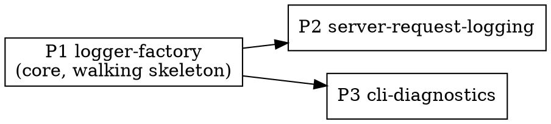

# Plan: Structured Logging Layer

**Source:** design.md + spec.md (`.harness/features/structured-logging-layer/`)
**Branch:** feat/structured-logging (worktree `.worktrees/structured-logging`)

## Overview

Add a coherent, level-based, structured (JSON) logging layer across `@samskara/core`, the server,
and the CLI using pino. A shared `createLogger` factory in core establishes level resolution,
NDJSON output, and redaction once; the server installs one global Hono middleware that mints a
`reqId`, binds a per-request child logger, enriches it with `userId`/`sessionId` and logs an ingest
outcome; the CLI raises verbosity with `--verbose` and replaces every silent `flushFile` branch and
the swallowed watch-loop catch with a level-appropriate structured line.

## Acceptance Criteria

- A single `reqId` correlates every server log line for one request; a single `sessionId`
  correlates the CLI outcome line with the server outcome line for the same session (grep-traceable).
- Default `info` output already carries the ids and counts needed to diagnose a dropped session:
  boot, per-request context, and human-readable ingest milestones (project upserted, session/subagent
  upserted, messages inserted, "Ingestion completed") + the CLI per-file upload outcome — all logged
  **after** the action, in readable prose, without raising verbosity. Granular detail (tool rows,
  token usage) sits at `debug`.
- The ingest service receives a `Ctx = { db, log, userId }` so service-layer lines inherit the
  request's `reqId`/`userId`/`sessionId`.
- **Testing policy:** tests cover logging infrastructure (factory config, level resolution, redaction
  behavior, middleware binds a request logger, the `Ctx` refactor, and no regressions) — not the
  wording/level/fields of individual emitted lines (those are reviewed, not asserted).
- Raising verbosity (`LOG_LEVEL=debug` or CLI `--verbose`) reveals exactly why a session was skipped
  or an upload failed on either side.
- No token, authorization header, password, secret, or raw event body (`content`/`thinking`/`raw`)
  appears in any log line.
- `bun run typecheck`, `bun run test`, and `bun run lint` all pass.

## Codebase Context

**Verified preconditions:**
- `@samskara/core` runtime deps are `zod` only; pino is **not** installed. Phase 1 adds `pino` to
  `packages/core/package.json` and must confirm `logger.child(...).setBindings(...)` exists in the
  installed version (pino ≥ 7) — the load-bearing enrichment API for F6/F7.
- Server tests (`packages/server/src/routes/ingest.test.ts`) spin up a real Postgres via
  `@testcontainers/postgresql`, gated behind `describe.skipIf(!dockerAvailable())`; they call
  `buildApp(db, env, deps?)` directly and drive requests with `app.request(...)`. New server log
  tests extend this harness (they run only when Docker is available).
- `buildApp(db, env, deps={})` already injects `deps.githubClient` / `deps.pairingStore` with
  defaults — the new `deps.rootLog` follows the same pattern.
- CLI driver tests (`packages/cli/src/watcher/driver.test.ts`) inject `WatcherDeps`
  (`fs`, `clock`, `sink`, `glob`, `plugin`, `resolveProject`) and use `createInMemorySink(statusFor)`.
  Every `flushFile` branch already has an exercising test (empty/no-session line 187, 409 line 101,
  success line 66, paging line 151) — the new `log` dep is asserted by capturing its output.
- `requireAuth` (`packages/server/src/lib/require-auth.ts`) sets `c.set("user", user)` after
  resolving; it is per-router middleware, so `userId` enrichment (REQ-009) happens there.
- The ingest service (`services/ingest.ts`) returns `{ ingested, deduped }` or
  `{ error: "sessionNotFound" }`; the handler (`routes/ingest.ts`) maps these to the outcome line.
- Migrations run via a separate `drizzle-kit migrate` script, never in the server process — only the
  "listening" boot line is logged (REQ-014).
- Biome: recommended rules, double quotes, no semicolons, 100-col, 2-space. `NODE_ENV` is not yet
  read anywhere.

**Logger injection contract (decided):**
- `createLogger(base, opts?)` where `opts = { level?: pino.Level; destination?: pino.DestinationStream }`.
  Tests pass a capturing destination; production omits it (stdout).
- Server: `buildApp(db, env, { rootLog? })` — defaults to `createLogger({ service: "samskara-server" })`.
- CLI: `WatcherDeps` gains `log: pino.Logger`; the watch entrypoint builds the root logger and passes
  a child.

## Phase Graph

P2 and P3 both depend only on P1 and are independent of each other — they run in parallel after P1.

## System E2E Tests

None cross-slice at the automated level. The end-to-end trace (CLI upload → server request →
ingest outcome, correlated by `sessionId`) is described as **VS-1** in spec.md and is exercised by
functional-verify, not a single automated phase test — it spans two processes (CLI + server) that
no one phase runs together.

## Phases

- **Phase 1 (logger-factory):** shared `createLogger` + `resolveLevel` in `@samskara/core` — the
  walking skeleton establishing level resolution, NDJSON, and redaction. Consumed by P2 and P3.
- **Phase 2 (server-request-logging):** global Hono middleware (reqId + request child logger +
  completion line), `userId` enrichment in auth, ingest handler `sessionId`/context enrichment +
  outcome line, `onError` handler, and the boot "listening" line.
- **Phase 3 (cli-diagnostics):** global `--verbose` flag, CLI root logger, structured logs for the
  three silent `flushFile` branches + success outcome, and the full-error watch-loop catch.
